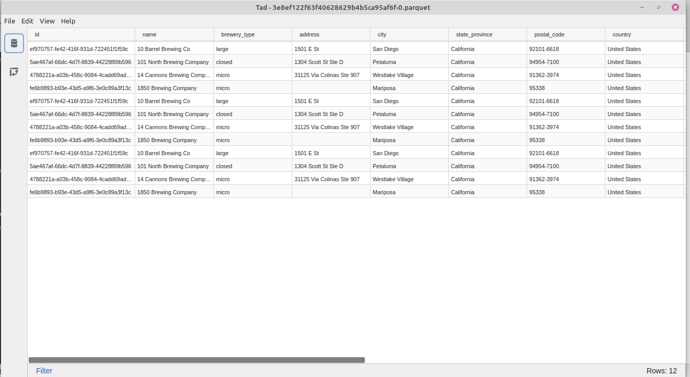
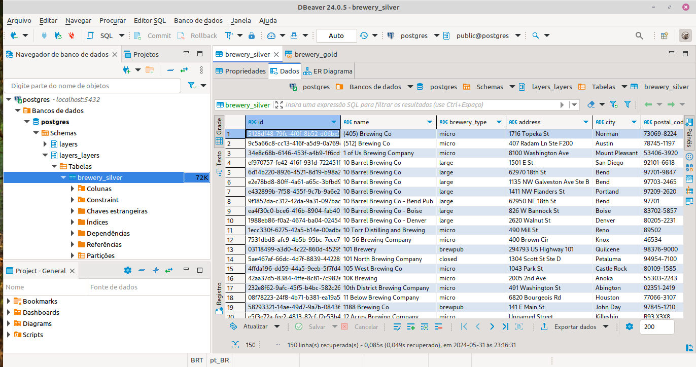
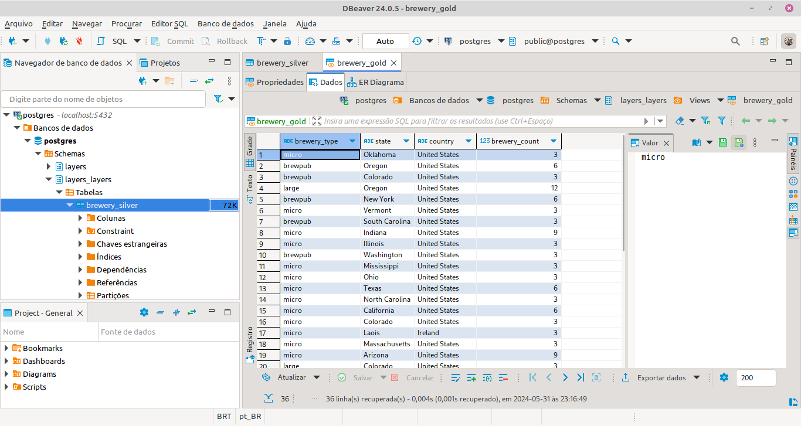

# Desafio da vaga de Data Engineer da ABInbev

## Árvore de diretórios

```bash
├── data
│   └── raw_data.json
├── gold
│   ├── analyses
│   ├── dbt_project.yml
│   ├── logs
│   │   └── dbt.log
│   ├── macros
│   ├── models
│   │   └── layers
│   │       ├── gold
│   │       │   └── brewery_gold.sql
│   │       ├── schema.yml
│   │       └── silver
│   │           └── brewery_silver.sql
│   ├── profiles.yml
│   ├── README.md
│   ├── seeds
│   │   └── raw_data.csv
├── images
│   ├── table.png
│   └── view.png
├── logs
│   └── dbt.log
├── Notebook
│   └── Exploratory analysis.ipynb
├── pipelines
│   ├── flows.py
│   ├── __init__.py
│   ├── run.py
│   ├── tasks.py
│   └── utils.py
├── README.md
├── requirements.txt
```
---

## Como utilizar este repositório

1. Crie um ambiente virtual e instale o arquivo `requirementx.txt`;

2. Instale e ative o serviço Docker;

3. Ative o ambiente virtual Python;

4. Crie a rede docker:

```docker
docker network create net
```

5. Crie o banco PostGreSQL:

```docker
docker run --name postgres -e POSTGRES_PASSWORD=postgres -p 5432:5432 --network net -d postgres
```

6. Crie uma pasta chamada `data` e uma pasta chamada `transformed_data`;

7. Crie um arquivo `profiles.yml` dentro da pasta `gold` e preencha com as informações do banco recém criado.

8. Execute o pipeline:

```python
python pipelines/run.py
```

----

## Camadas da arquitetura *medallion*

- **Bronze layer**: A camada bronze se encontra na pasta `transformed_data` em que estão armazenados os arquivos parquet particionados por estado.



- **Silver layer**: A camada prata está no modelo `brewery_silver.sql` que transforma o arquivo bruto do seed do dbt em uma tabela materializada no PostgreSql.



- **Gold layer**: A cama ouro está no modelo `brewery_gold.sql` que cria uma view no banco de dados a partir da tabela materializada na *silver layer*.



## Monitoramento

Uma possibilidade de monitoramento seria transferir o Datalake para nuvem e, a partir de ajustes no pipeline Prefect colocar um *scheduler* para atualizar os dados de tempos em tempos, a cada mês, por exemplo.

Além disso, a partir do armazenamento do datalake em uma nuvem, como o GCP, por exemplo, seria possível criar um protocolo no Dataplex para automatizar testes de qualidade de código, ao invés de utilizar a funcionalidade do próprio dbt.

## DBT - funcionalidades extras

- Para realizar testes com o dbt, acesse a pasta do projeto do dbt em um terminal e digite:

```dbt
dbt test
```

- Para visualizar a documentação das tabelas no DBT, digite:

```dbt
dbt docs generate
```

- Em seguida, digite:

```dbt 
dbt docs serve
```

----